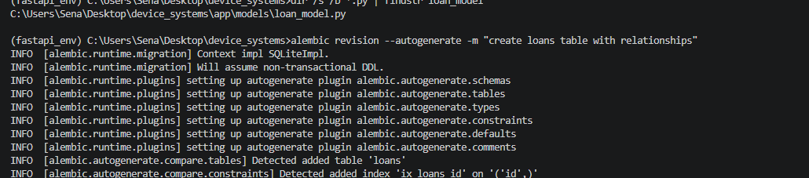
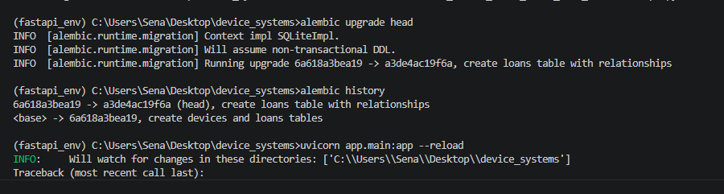
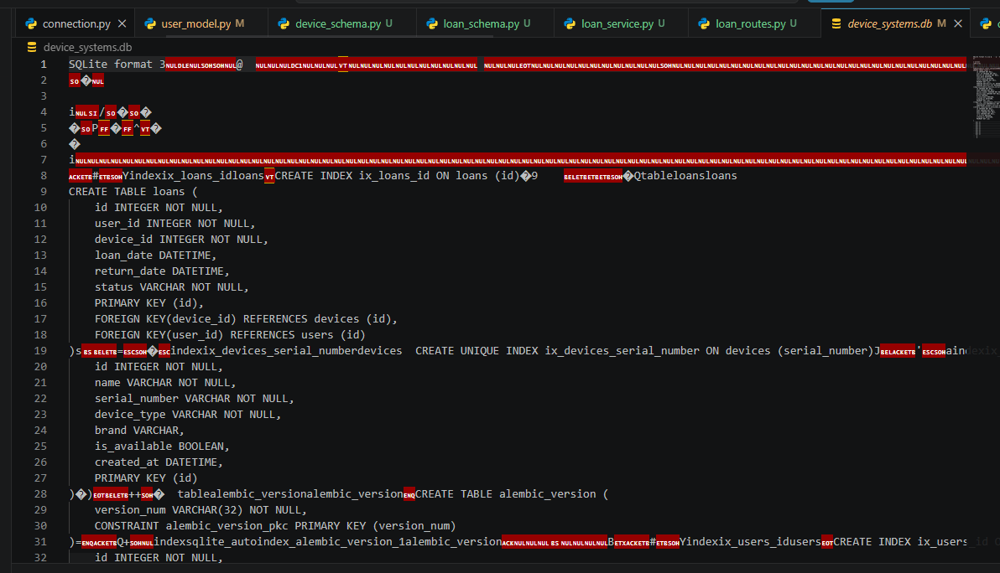
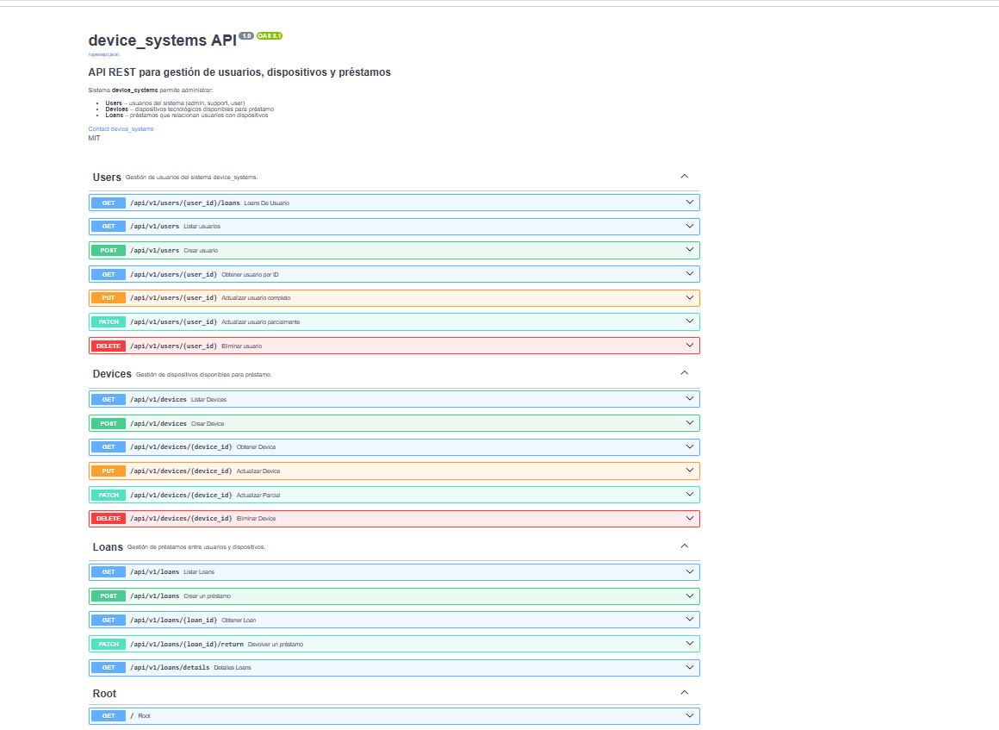
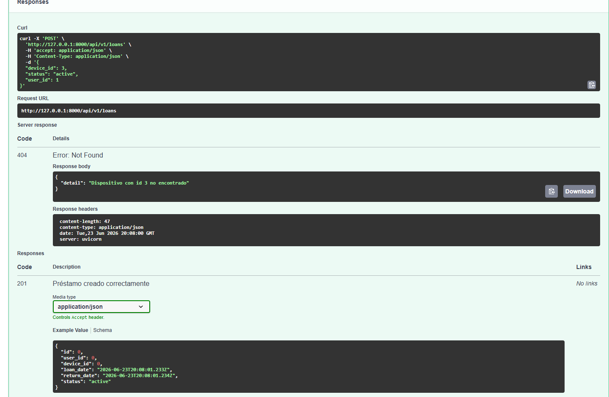
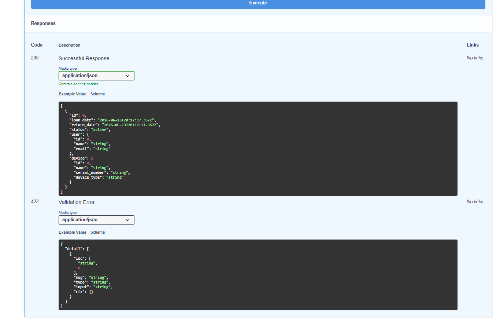
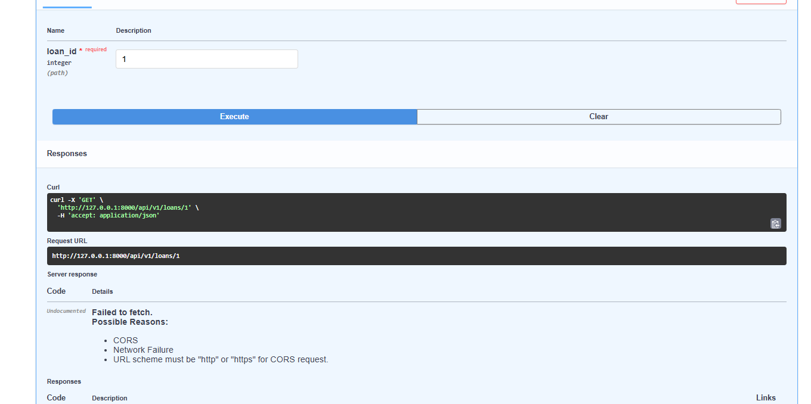
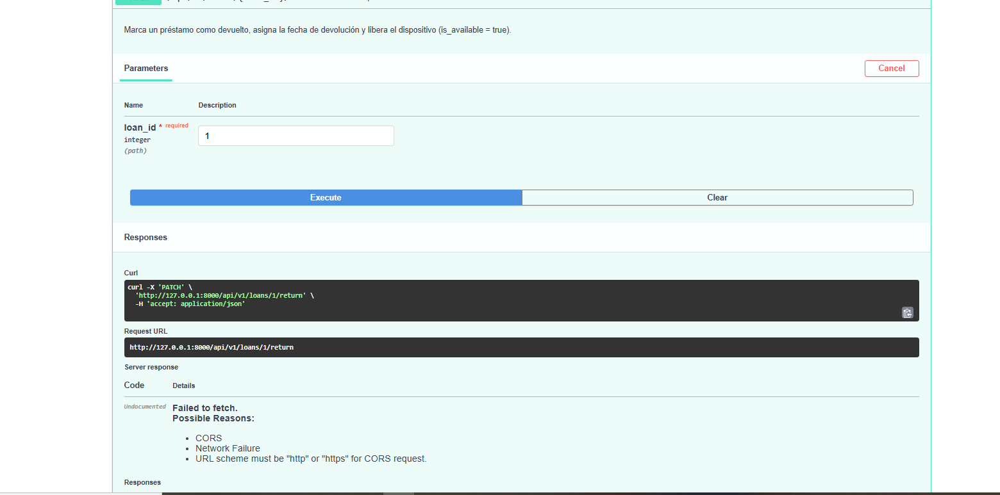
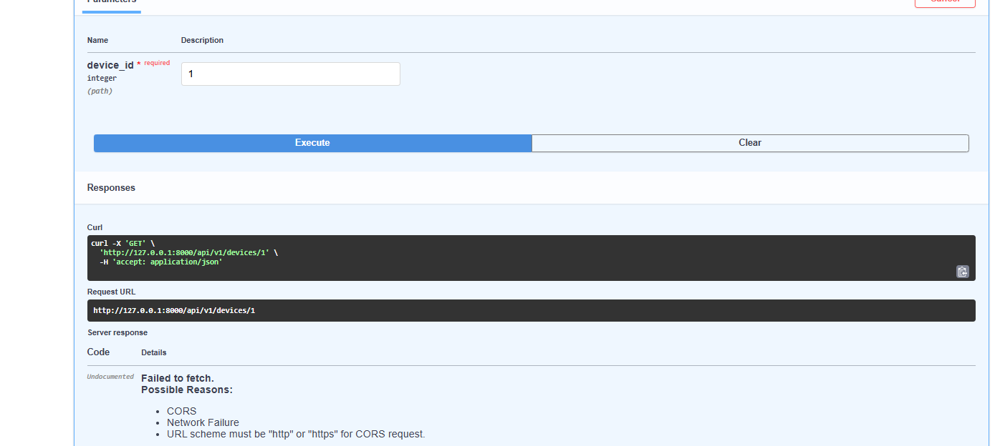

# device_systems API

API REST construida con FastAPI, SQLAlchemy y Alembic para la gestión de usuarios, dispositivos y préstamos del sistema device_systems.

---

## Tecnologías utilizadas

- Python 3.x
- FastAPI
- Uvicorn
- Pydantic v2
- SQLAlchemy
- Alembic (migraciones)
- SQLite

---

##  Instalación de dependencias

```bash
git clone https://github.com/TU_USUARIO/device_systems.git
cd device_systems
git checkout device_systems_alembic_relaciones
python -m venv fastapi_env
.\fastapi_env\Scripts\Activate.ps1
pip install -r requirements.txt
```

---

## Migraciones con Alembic

### Inicialización de Alembic

Se inicializó Alembic en la raíz del proyecto para gestionar el versionado de la base de datos:

```bash
alembic init alembic
```

### Configuración

Se configuró `alembic.ini` con la URL de conexión a SQLite:
```ini
sqlalchemy.url = sqlite:///./device_systems.db
```

Y se configuró `alembic/env.py` para reconocer la metadata de SQLAlchemy y los modelos del proyecto (`User`, `Device`, `Loan`).

### Generación de migraciones

```bash
alembic revision --autogenerate -m "create devices and loans tables"
```



### Aplicación de migraciones

```bash
alembic upgrade head
```



### Historial de migraciones

```bash
alembic history
```



---

##  Ejecución del servidor

```bash
uvicorn app.main:app --reload
```

Documentación interactiva disponible en:
http://127.0.0.1:8000/docs

http://127.0.0.1:8000/redoc



---

## 🗂️ Estructura del proyecto
device_systems/

│── app/

│   │── main.py

│   │── database/

│   │   └── connection.py

│   │── models/

│   │   │── user_model.py

│   │   │── device_model.py

│   │   └── loan_model.py

│   │── schemas/

│   │   │── user_schema.py

│   │   │── device_schema.py

│   │   └── loan_schema.py

│   │── routes/

│   │   │── user_routes.py

│   │   │── device_routes.py

│   │   └── loan_routes.py

│   │── services/

│   │   │── user_service.py

│   │   │── device_service.py

│   │   └── loan_service.py

│   └── dependencies/

│       │── user_dependencies.py

│       └── database_dependency.py

│── alembic/

│   └── versions/

│── alembic.ini

│── img/

│── requirements.txt

└── README.md

---

## Modelos y asociaciones

- **User** — usuarios del sistema (`id`, `name`, `email`, `role`, `is_active`, `created_at`)
- **Device** — dispositivos disponibles para préstamo (`id`, `name`, `serial_number`, `device_type`, `brand`, `is_available`, `created_at`)
- **Loan** — préstamos que relacionan usuarios y dispositivos (`id`, `user_id`, `device_id`, `loan_date`, `return_date`, `status`)

### Relaciones

```python
# User
loans = relationship("Loan", back_populates="user")

# Device
loans = relationship("Loan", back_populates="device")

# Loan
user = relationship("User", back_populates="loans")
device = relationship("Device", back_populates="loans")
```
User (1) ──────< (N) Loan (N) >────── (1) Device

---

## Endpoints — Users

| Método | Endpoint | Descripción | Código |
|--------|----------|-------------|--------|
| GET | /api/v1/users | Lista usuarios | 200 |
| GET | /api/v1/users/{user_id} | Obtiene usuario por ID | 200 |
| GET | /api/v1/users/{user_id}/loans | Préstamos de un usuario | 200 |
| POST | /api/v1/users | Crea usuario | 201 |
| PUT | /api/v1/users/{user_id} | Actualiza usuario completo | 200 |
| PATCH | /api/v1/users/{user_id} | Actualiza usuario parcial | 200 |
| DELETE | /api/v1/users/{user_id} | Elimina usuario | 204 |

## Endpoints — Devices

| Método | Endpoint | Descripción | Código |
|--------|----------|-------------|--------|
| GET | /api/v1/devices | Lista dispositivos (filtros: device_type, is_available, brand, search) | 200 |
| GET | /api/v1/devices/{device_id} | Obtiene dispositivo por ID | 200 |
| GET | /api/v1/devices/{device_id}/loans | Historial de préstamos del dispositivo | 200 |
| POST | /api/v1/devices | Crea dispositivo | 201 |
| PUT | /api/v1/devices/{device_id} | Actualiza dispositivo completo | 200 |
| PATCH | /api/v1/devices/{device_id} | Actualiza dispositivo parcial | 200 |
| DELETE | /api/v1/devices/{device_id} | Elimina dispositivo | 204 |

##  Endpoints — Loans

| Método | Endpoint | Descripción | Código |
|--------|----------|-------------|--------|
| GET | /api/v1/loans | Lista préstamos (filtro por status) | 200 |
| GET | /api/v1/loans/{loan_id} | Obtiene préstamo por ID | 200 |
| GET | /api/v1/loans/details | Préstamos con info de usuario y dispositivo (joins) | 200 |
| POST | /api/v1/loans | Crea préstamo (valida existencia y disponibilidad) | 201 |
| PATCH | /api/v1/loans/{loan_id}/return | Devuelve un préstamo y libera el dispositivo | 200 |

---

##  Evidencias funcionales

### Creación de usuario
```json
{ "name": "Ana Pérez", "email": "ana@sena.edu.co", "role": "user", "is_active": true }
```


### Creación de dispositivo
```json
{ "name": "Laptop Lenovo ThinkPad", "serial_number": "LEN-2024-001", "device_type": "laptop", "brand": "lenovo", "is_available": true }
```


### Creación de préstamo
```json
{ "user_id": 1, "device_id": 1, "status": "active" }
```


### Consulta con joins — préstamos con información relacionada
`GET /api/v1/loans/details`

Esta consulta usa `join()` entre `Loan`, `User` y `Device`, retornando el detalle anidado de cada relación.


### Filtros aplicados
`GET /api/v1/loans?status=active`
`GET /api/v1/devices?device_type=laptop`

Los filtros usan `ilike()` para búsquedas insensibles a mayúsculas y `and_()`/`or_()` para combinar condiciones.


### Devolución de dispositivo
`PATCH /api/v1/loans/1/return`

Marca el préstamo como `returned`, asigna `return_date` y libera el dispositivo (`is_available: true`).


### Verificación de disponibilidad tras devolución
`GET /api/v1/devices/1`


---

##  Manejo de errores

| Caso | Código |
|------|--------|
| Registro creado | 201 Created |
| Consulta exitosa | 200 OK |
| Eliminación exitosa | 204 No Content |
| Usuario/dispositivo/préstamo no encontrado | 404 Not Found |
| Email o número de serie duplicado | 400 Bad Request |
| Dispositivo no disponible / préstamo ya devuelto | 409 Conflict |
| Error de validación | 422 Unprocessable Entity |

---

## 💡 Reflexión

Las migraciones con Alembic permiten versionar los cambios en la estructura de la base de datos de forma
controlada y reproducible, evitando modificar tablas manualmente y facilitando el trabajo en equipo. Las
relaciones entre modelos (`relationship()` y `ForeignKey`) permiten representar de forma natural cómo
los datos del mundo real se conectan entre sí —en este caso, usuarios que solicitan dispositivos mediante
préstamos—, manteniendo la integridad referencial de la base de datos. Las consultas avanzadas con `join()`,
`and_()`, `or_()` e `ilike()` permiten construir respuestas enriquecidas que combinan información de varias
tablas en una sola petición, evitando que el cliente tenga que hacer múltiples llamadas para obtener el
contexto completo de un recurso. En conjunto, estas herramientas son fundamentales para construir APIs REST
escalables y mantenibles en proyectos reales.