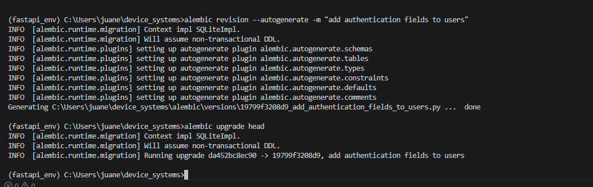
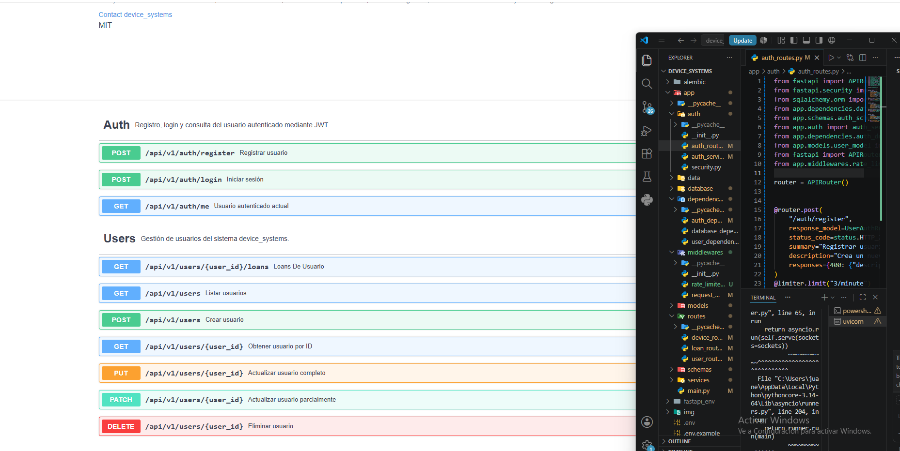
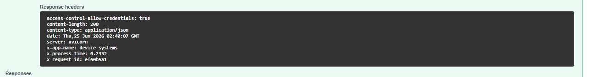
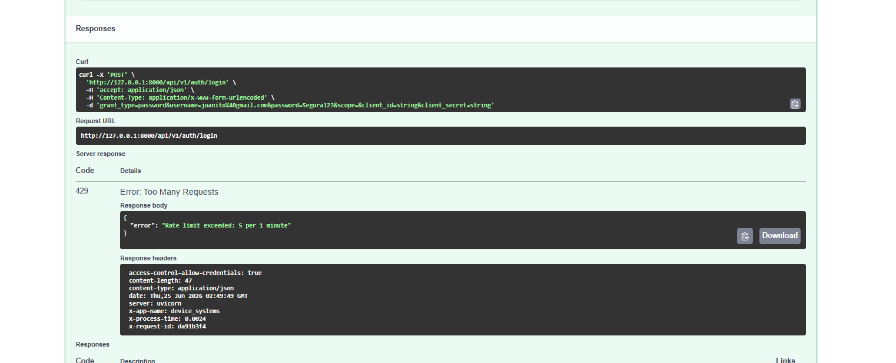
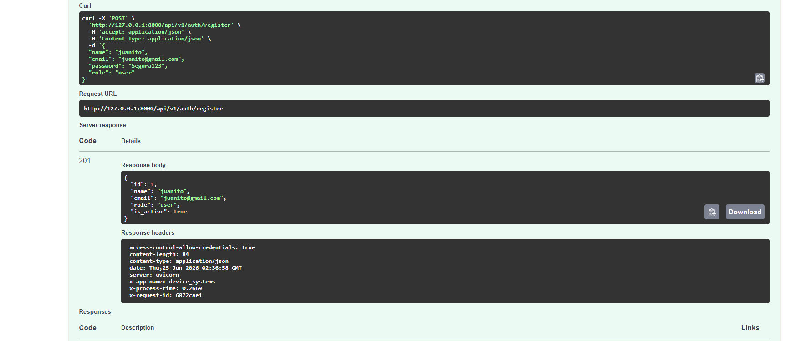
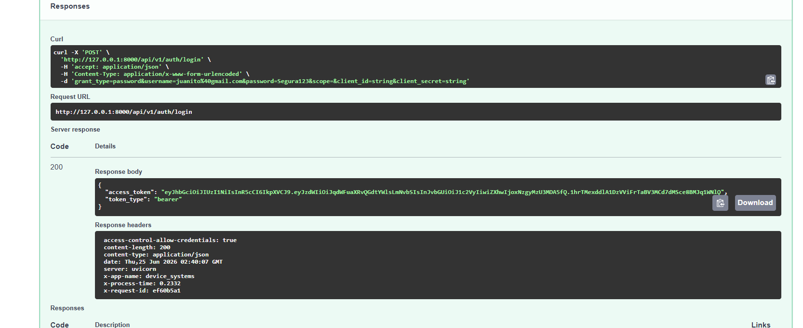
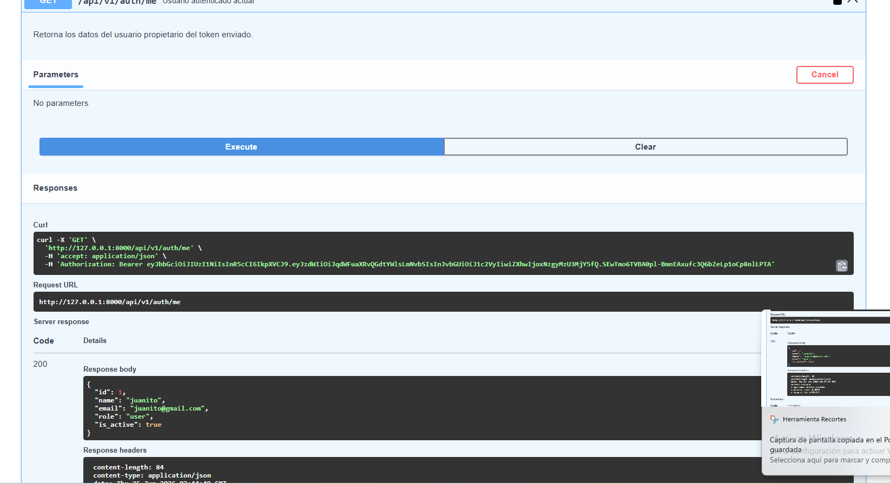
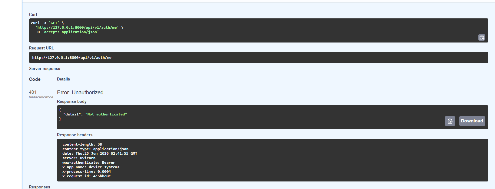
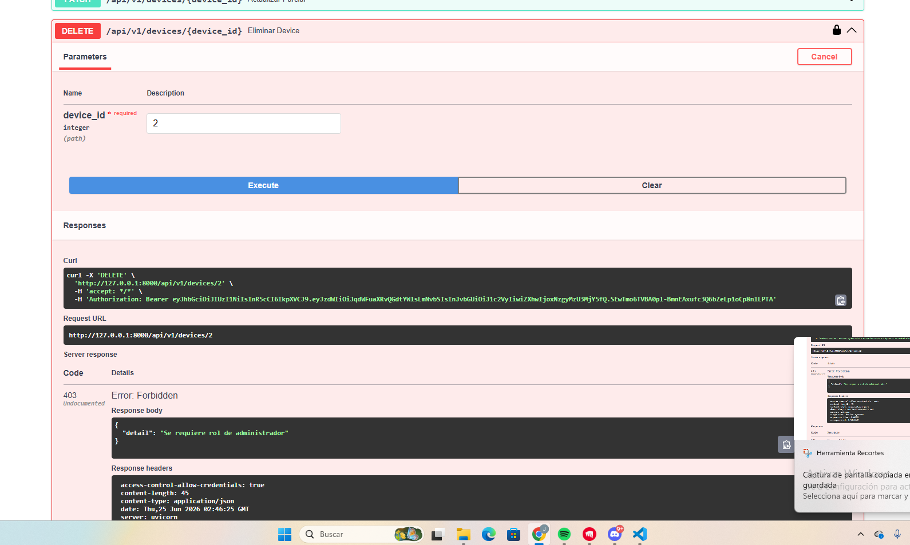
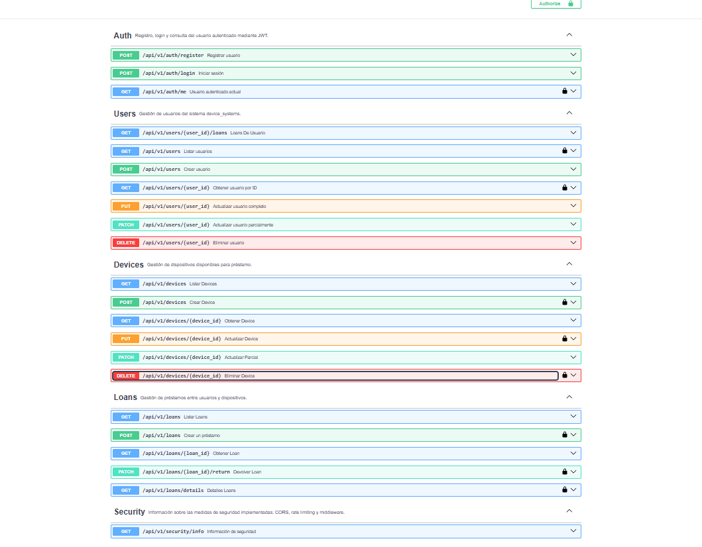

# device_systems API

API REST construida con FastAPI, SQLAlchemy, Alembic y seguridad OAuth2/JWT para la gestión de usuarios, dispositivos y préstamos del sistema device_systems.

---

##  Tecnologías utilizadas

- Python 3.x · FastAPI · Uvicorn
- SQLAlchemy · Alembic · SQLite
- Pydantic v2
- Passlib (bcrypt) · python-jose (JWT)
- Slowapi (rate limiting)

---

##  Instalación

```bash
git clone https://github.com/TU_USUARIO/device_systems.git
cd device_systems
git checkout device_systems_security
python -m venv fastapi_env
.\fastapi_env\Scripts\Activate.ps1
pip install -r requirements.txt
```

### Variables de entorno

Copia `.env.example` a `.env` y completa tus valores:

```env
SECRET_KEY=tu_clave_secreta_larga_y_aleatoria
ALGORITHM=HS256
ACCESS_TOKEN_EXPIRE_MINUTES=30
```

>  El archivo `.env` nunca se sube al repositorio (está en `.gitignore`). Solo `.env.example` se versiona, como plantilla.

---

## 🗄️ Migraciones con Alembic

```bash
alembic upgrade head
```

Se generó una migración para añadir los campos de autenticación al modelo `User`:

```bash
alembic revision --autogenerate -m "add authentication fields to users"
alembic upgrade head
```



---

##  Ejecución del servidor

```bash
uvicorn app.main:app --reload
```
http://127.0.0.1:8000/docs

http://127.0.0.1:8000/redoc

---

## Estructura del proyecto


device_systems/

│── app/

│   │── main.py

│   │── auth/

│   │   │── auth_routes.py

│   │   │── auth_service.py

│   │   └── security.py

│   │── database/

│   │   └── connection.py

│   │── models/

│   │   │── user_model.py

│   │   │── device_model.py

│   │   └── loan_model.py

│   │── schemas/

│   │   │── user_schema.py

│   │   │── device_schema.py

│   │   │── loan_schema.py

│   │   └── auth_schema.py

│   │── routes/

│   │   │── user_routes.py

│   │   │── device_routes.py

│   │   └── loan_routes.py

│   │── services/

│   │   │── user_service.py

│   │   │── device_service.py

│   │   └── loan_service.py

│   │── dependencies/

│   │   │── database_dependency.py

│   │   │── user_dependencies.py

│   │   └── auth_dependency.py

│   └── middlewares/

│       │── request_middleware.py

│       └── rate_limiter.py

│── alembic/

│   └── versions/

│── .env.example

│── alembic.ini

│── img/

│── requirements.txt

└── README.md

---

##  Autenticación y autorización

### Roles disponibles
`admin` · `support` · `user`

### Endpoints de autenticación

| Método | Endpoint | Descripción | Límite |
|--------|----------|-------------|--------|
| POST | /api/v1/auth/register | Registra un usuario nuevo | 3/min |
| POST | /api/v1/auth/login | Autentica y retorna JWT | 5/min |
| GET | /api/v1/auth/me | Datos del usuario autenticado | — |

### Protección por ruta

| Ruta | Protección requerida |
|------|----------------------|
| GET /users | Usuario autenticado |
| GET /users/{id} | Usuario autenticado |
| POST /devices | Admin o support |
| PUT /devices/{id} | Admin o support |
| DELETE /devices/{id} | Admin |
| POST /loans | Usuario autenticado |
| PATCH /loans/{id}/return | Admin o support |
| GET /loans/details | Admin o support |

---

##  Configuración CORS

```python
app.add_middleware(
    CORSMiddleware,
    allow_origins=["http://localhost:5173", "http://localhost:3000"],
    allow_credentials=True,
    allow_methods=["*"],
    allow_headers=["*"],
)
```

**¿Por qué no usar `allow_origins=["*"]` junto con `allow_credentials=True`?**

El estándar CORS prohíbe esta combinación porque, si cualquier origen pudiera enviar credenciales
(cookies, tokens en headers), un sitio malicioso podría hacer peticiones autenticadas a la API en
nombre de la víctima sin que ella lo note. Por eso los navegadores exigen una lista explícita de
orígenes confiables cuando se permiten credenciales, en lugar de aceptar un comodín.

---

##  Middleware personalizado

Cada respuesta incluye estas cabeceras, generadas por `RequestLoggingMiddleware`:
X-App-Name: device_systems

X-Process-Time: 0.0042

X-Request-ID: 8f42e9c1

Además, cada petición se registra en consola con método, ruta y código de estado.



---

##  Rate Limiting

| Endpoint | Límite |
|----------|--------|
| POST /auth/login | 5 por minuto |
| POST /auth/register | 3 por minuto |
| GET /users | 30 por minuto |
| POST /loans | 10 por minuto |

Al superar el límite, la API responde `429 Too Many Requests`.



---

## 📸 Evidencias de pruebas funcionales

### Registro de usuario


### Login y token generado


### Consulta /auth/me


### Acceso sin token


### Acceso con rol no permitido


### Swagger/OpenAPI con OAuth2


---

## Manejo de errores

| Caso | Código |
|------|--------|
| Registro/creación exitosa | 201 Created |
| Consulta/login exitosa | 200 OK |
| Eliminación exitosa | 204 No Content |
| Recurso no encontrado | 404 Not Found |
| Dato duplicado | 400 Bad Request |
| Sin token / token inválido | 401 Unauthorized |
| Sin permisos para la acción | 403 Forbidden |
| Regla de negocio incumplida | 409 Conflict |
| Error de validación | 422 Unprocessable Entity |
| Límite de peticiones excedido | 429 Too Many Requests |

---

##  Reflexión final

La seguridad en una API REST no es un complemento opcional, sino una capa estructural que determina
si el sistema puede usarse en un entorno real. Implementar autenticación con OAuth2 y JWT permite que
cada cliente demuestre su identidad sin que el servidor tenga que recordar sesiones, lo cual escala mejor
y se integra naturalmente con aplicaciones frontend modernas. El hash de contraseñas con bcrypt garantiza
que, incluso si la base de datos fuera comprometida, las contraseñas originales de los usuarios permanezcan
protegidas. La autorización basada en roles asegura que cada usuario solo pueda realizar las acciones que
le corresponden, evitando que cualquier cuenta autenticada tenga acceso irrestricto. El middleware de
trazabilidad y las cabeceras personalizadas facilitan la depuración y el monitoreo en producción, mientras
que el rate limiting protege la API de abuso, fuerza bruta y ataques de denegación de servicio. Configurar
CORS correctamente, sin combinar comodines con credenciales, evita exponer la API a peticiones maliciosas
desde dominios no autorizados. En conjunto, estas prácticas transforman una API funcional en una API
production-ready, capaz de proteger tanto los datos del sistema como la confianza de quienes la consumen.