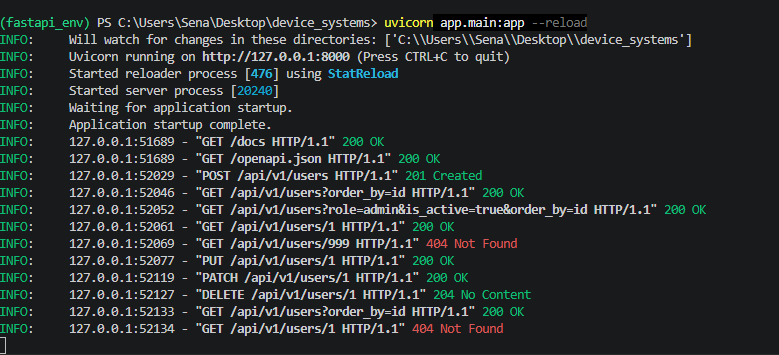
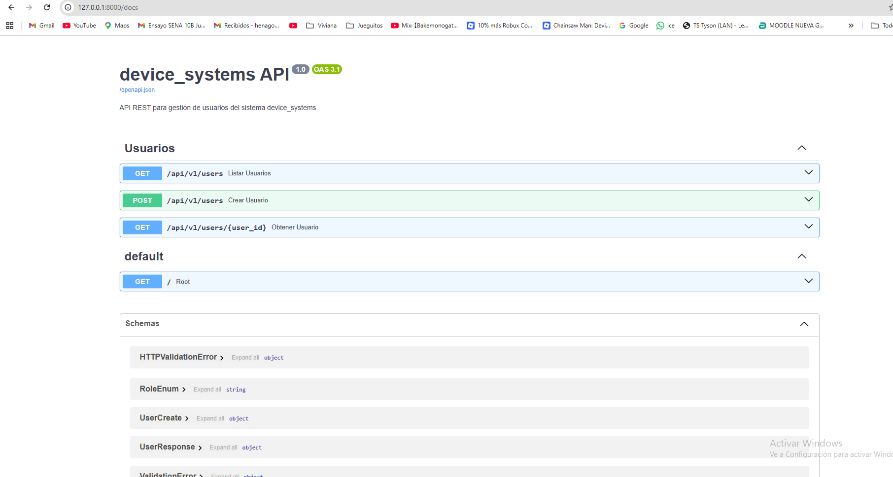
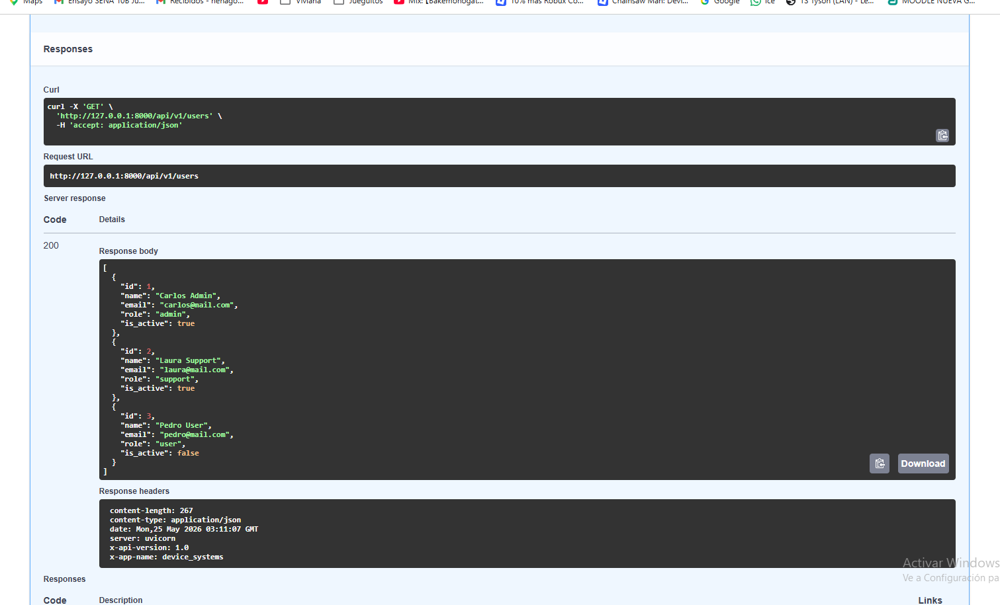
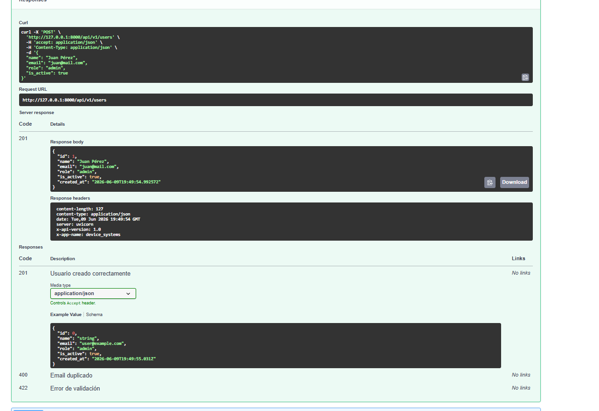
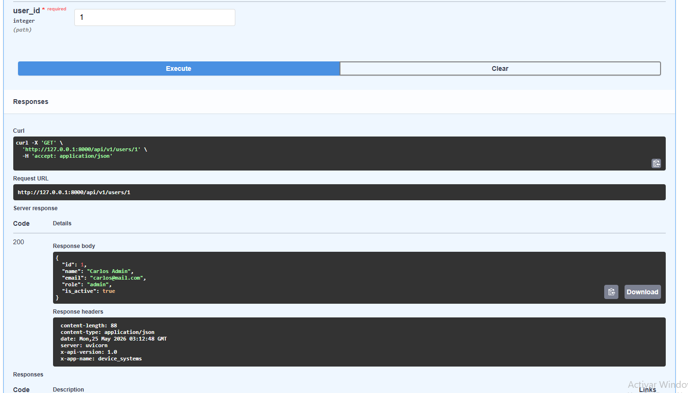
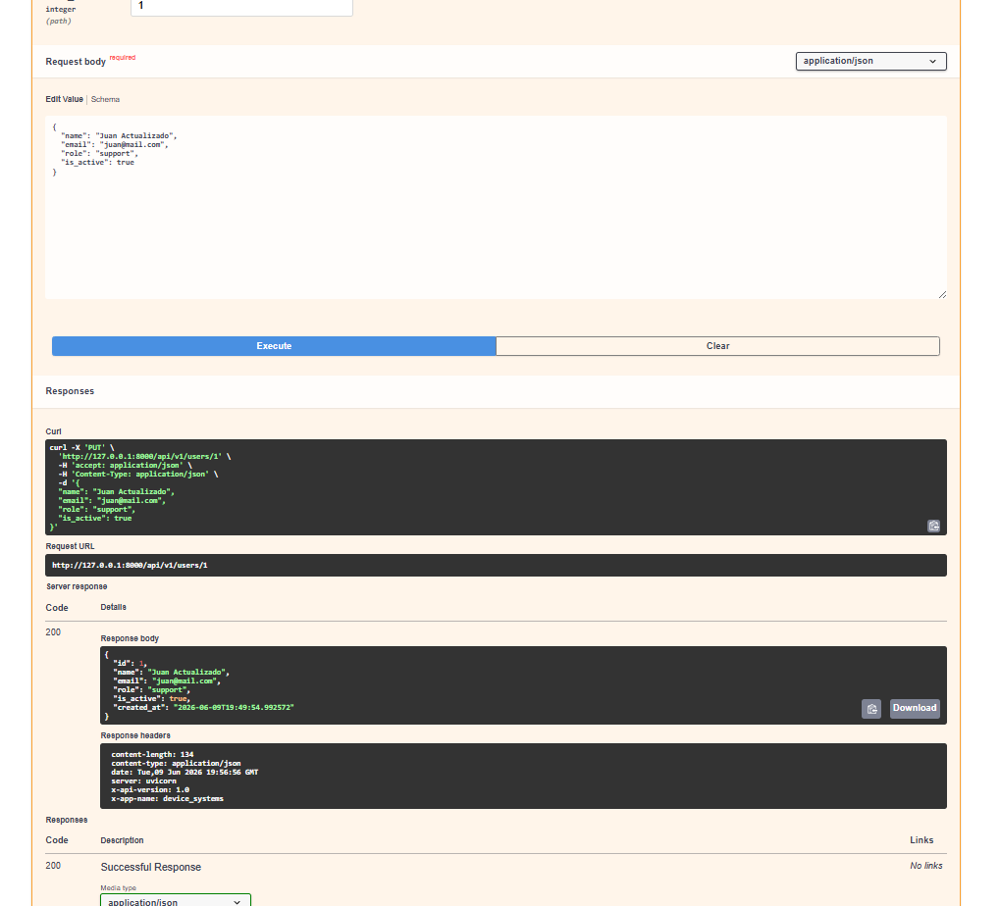
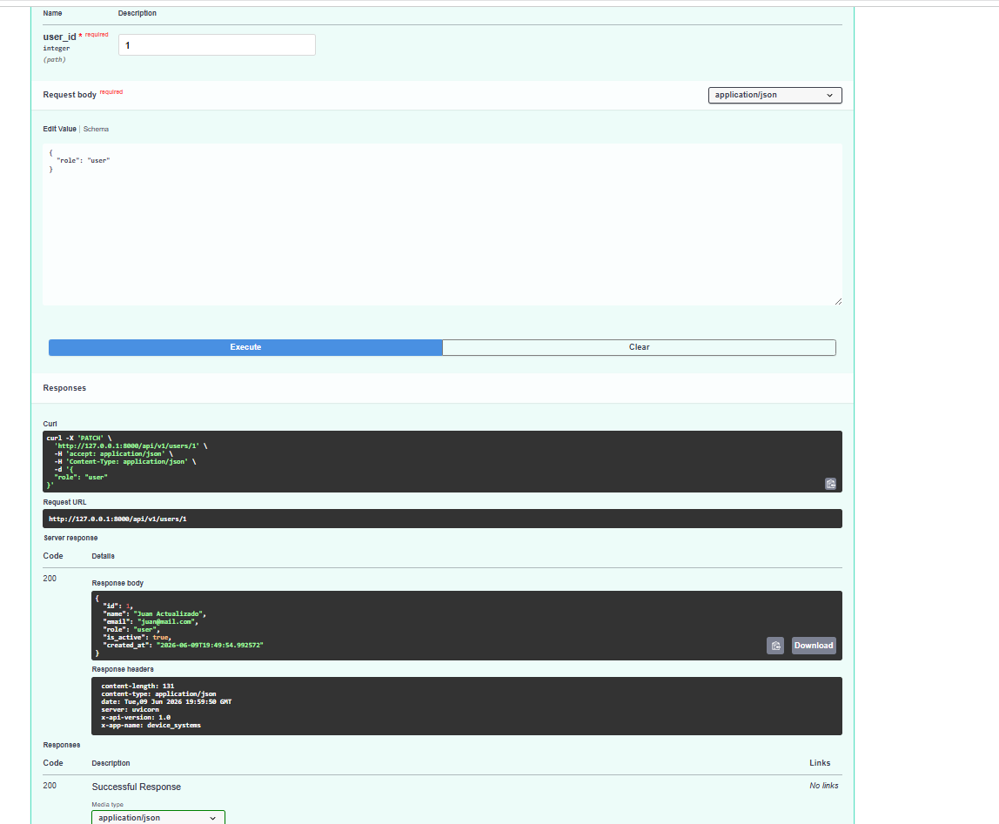
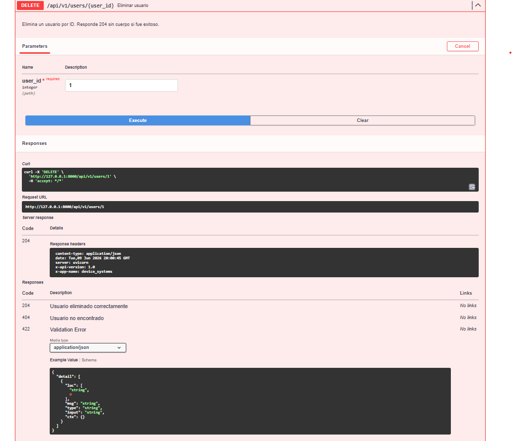
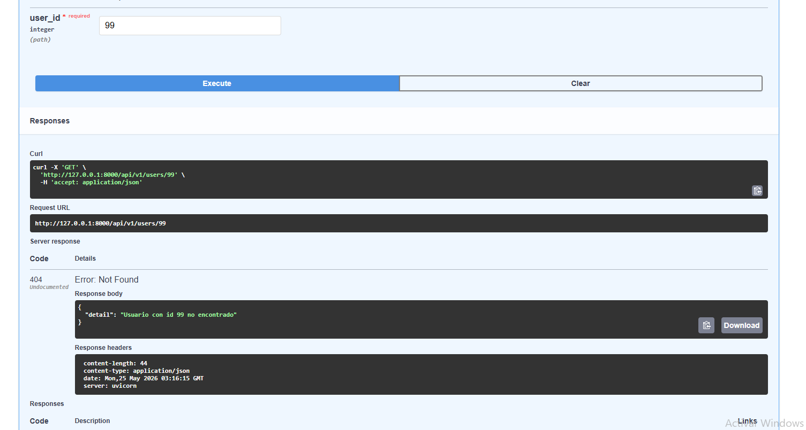

# device_systems API

API REST construida con FastAPI para la gestión de usuarios del sistema device_systems.

---

## Tecnologías utilizadas

- Python 3.x
- FastAPI
- Uvicorn
- Pydantic v2
- SQLAlchemy
- SQLite

---

## Instalación de dependencias

Clona el repositorio y activa el entorno virtual:

```bash
git clone https://github.com/TU_USUARIO/device_systems.git
cd device_systems
python -m venv fastapi_env
.\fastapi_env\Scripts\Activate.ps1
pip install -r requirements.txt
```

---

##  Ejecución del servidor

```bash
uvicorn app.main:app --reload
```

Abre en tu navegador:
http://127.0.0.1:8000/docs



---

## Estructura del proyecto
device_systems/
│── app/
│   │── main.py
│   │── database/
│   │   └── connection.py
│   │── models/
│   │   └── user_model.py
│   │── routes/
│   │   └── user_routes.py
│   │── schemas/
│   │   └── user_schema.py
│   │── services/
│   │   └── user_service.py
│   │── dependencies/
│   │   │── user_dependencies.py
│   │   └── database_dependency.py
│   └── data/
│       └── users_db.py
│── img/
│── requirements.txt
└── README.md

---

##  Tabla de endpoints

| Método | Endpoint | Descripción | Código |
|--------|----------|-------------|--------|
| GET | /api/v1/users | Lista todos los usuarios | 200 |
| GET | /api/v1/users/{user_id} | Obtiene un usuario por ID | 200 |
| POST | /api/v1/users | Crea un nuevo usuario | 201 |
| PUT | /api/v1/users/{user_id} | Actualiza usuario completo | 200 |
| PATCH | /api/v1/users/{user_id} | Actualiza usuario parcialmente | 200 |
| DELETE | /api/v1/users/{user_id} | Elimina un usuario | 204 |

---

##  Ejemplos de peticiones

### GET /api/v1/users
http://127.0.0.1:8000/api/v1/users

### GET con filtro por rol
http://127.0.0.1:8000/api/v1/users?role=admin

### GET con filtro por estado
http://127.0.0.1:8000/api/v1/users?is_active=true

### POST /api/v1/users
```json
{
  "name": "Juan Pérez",
  "email": "juan@mail.com",
  "role": "admin",
  "is_active": true
}
```

### PUT /api/v1/users/{user_id}
```json
{
  "name": "Juan Actualizado",
  "email": "juan@mail.com",
  "role": "support",
  "is_active": true
}
```

### PATCH /api/v1/users/{user_id}
```json
{
  "role": "user"
}
```

---

##  Evidencias Swagger UI

### Interfaz general


---

##  Evidencias GET

### GET /api/v1/users — Listar todos los usuarios


### GET /api/v1/users/{user_id} — Buscar por ID


### GET /api/v1/users?role=admin — Filtro por rol


---

##  Evidencias POST

### POST /api/v1/users — Crear usuario válido


### Error 400 — Correo duplicado


---

##  Evidencias PUT y PATCH

### PUT /api/v1/users/{user_id} — Actualización completa


### PATCH /api/v1/users/{user_id} — Actualización parcial


---

##  Evidencias DELETE

### DELETE /api/v1/users/{user_id} — Eliminar usuario


### Confirmación — Usuario eliminado


### Error 404 — Usuario no encontrado tras eliminar


---

##  Manejo de errores

| Caso | Código |
|------|--------|
| Usuario creado | 201 Created |
| Consulta correcta | 200 OK |
| Actualización correcta | 200 OK |
| Eliminación correcta | 204 No Content |
| Usuario no encontrado | 404 Not Found |
| Email duplicado | 400 Bad Request |
| Error de validación | 422 Unprocessable Entity |
| Rol no permitido | 422 Unprocessable Entity |

---

##  Reflexión

FastAPI permite construir APIs REST de forma rápida y ordenada gracias a su integración
con Pydantic para validación de datos, SQLAlchemy para la persistencia en base de datos,
y la generación automática de documentación con Swagger UI. Durante este proyecto aprendí
a estructurar una API con separación de responsabilidades en rutas, esquemas, servicios,
dependencias y modelos de base de datos, aplicar validaciones, manejar errores HTTP
correctamente y usar SQLite como base de datos de desarrollo. Esto me da una base sólida
para construir backends más complejos con bases de datos reales en producción.